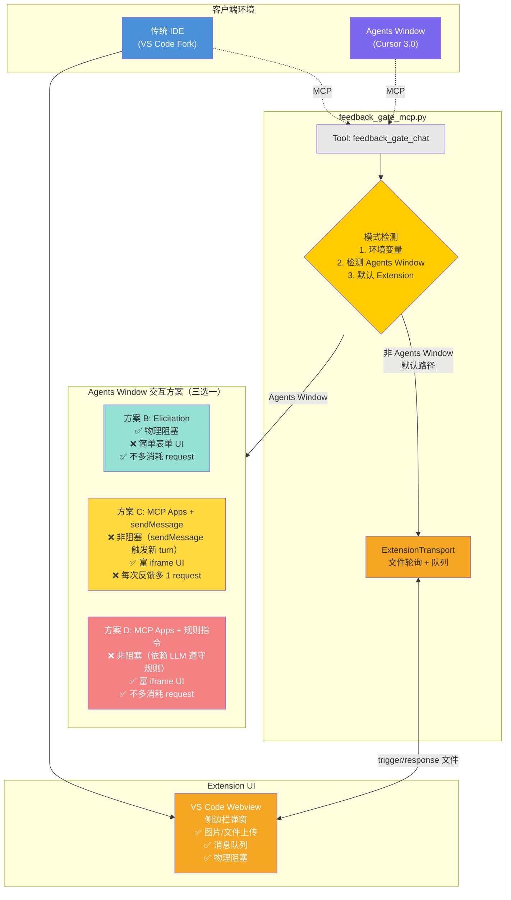
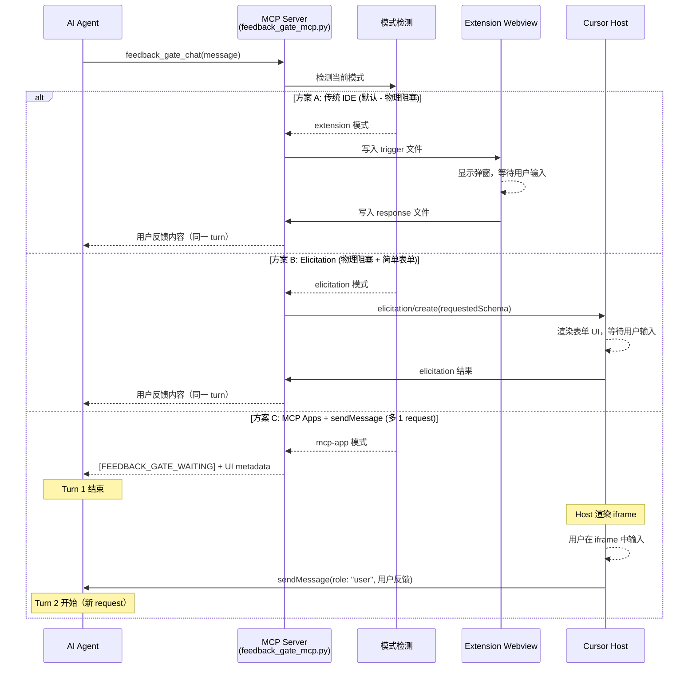

# Feedback Gate — MCP Apps 适配方案

> 让 Feedback Gate 同时支持 Cursor 传统 IDE 和 Agents Window（Cursor 3.0），自动切换交互模式。

## 一、背景

### 1.1 Cursor 3.0 变化

Cursor 3.0（2026-04-02）引入了 **Agents Window** — 一个独立的、以 Agent 为中心的全屏工作区。

| 特性 | 传统 IDE | Agents Window |
|------|---------|---------------|
| 界面基础 | VS Code Fork | 全新构建 |
| VS Code Extension | ✅ 支持 | ❌ 不支持 |
| MCP Apps (iframe) | ✅ 支持 (v2.6+) | ✅ 支持 |
| MCP Tools | ✅ | ✅ |
| Agent 对话 | Composer 面板 | Agent Tab（多 Tab 并行） |
| 文件隔离 | 多窗口 | Git Worktree |

### 1.2 影响

Feedback Gate 当前依赖 VS Code Extension（侧边栏 Webview + 文件轮询），在 Agents Window 中**无法工作**。需要一套兼容方案。

### 1.3 MCP Apps

MCP Apps（规范版本 2026-01-26，Status: Stable）是 MCP 的官方扩展，允许 MCP Server 向客户端返回交互式 HTML UI（在 sandboxed iframe 中渲染）。

- 规范: [ext-apps](https://github.com/modelcontextprotocol/ext-apps)
- SDK: `@modelcontextprotocol/ext-apps` v1.5.0
- 客户端支持: Cursor (v2.6+), Claude, ChatGPT, Goose, VS Code Insiders

## 二、方案概览

### 2.1 架构图



> **方案 E（未来）**：Rich UI Elicitation（阻塞 + 富 UI + 不多消耗 request），MCP 规范正在推进中（[Issue #511](https://github.com/modelcontextprotocol/ext-apps/issues/511)），落地后将成为最佳方案。

### 2.2 数据流时序图



**核心思路**: 同一个 MCP Server，**默认使用 Extension 模式**（与现有行为一致），只有检测到 Agents Window 时才切换。Agents Window 有三种方案可选（B/C/D），各有取舍。

## 三、模式切换逻辑

### 3.1 自动检测

```
Tool 被调用
  ├─ 检查环境变量 FEEDBACK_GATE_MODE
  │   ├─ "extension"   → 强制 Extension 模式
  │   ├─ "elicitation"  → 强制 Elicitation 模式
  │   ├─ "mcp-app"     → 强制 MCP App 模式 (sendMessage)
  │   └─ "auto"(默认)   → 进入自动检测 ↓
  │
  ├─ 检测 Extension 是否存活
  │   方式 1: 检查 Extension PID 文件是否存活 → os.kill(pid, 0)
  │   方式 2: (备用) 检查 MCP 客户端 capabilities 特征
  │   耗时: < 1ms
  │   ├─ Extension 存活 → Extension 模式 (方案 A，完整功能 + 队列)
  │   └─ Extension 不存活 → 进入 Agents Window 方案选择 ↓
  │
  ├─ Agents Window 方案选择
  │   ├─ 客户端支持 Elicitation → Elicitation 模式 (方案 B，推荐)
  │   ├─ 客户端支持 MCP Apps   → MCP App 模式 (方案 C，每次反馈多 1 request)
  │   └─ 都不支持              → 纯文本 Tool 返回 (降级)
  │
  └─ 默认: Extension 模式 (与现有行为完全一致)
```

### 3.2 环境变量

在 `mcp.json` 中可手动指定模式：

```json
{
  "mcpServers": {
    "feedback-gate": {
      "command": "python3",
      "args": ["/path/to/feedback_gate_mcp.py"],
      "env": {
        "FEEDBACK_GATE_MODE": "auto"
      }
    }
  }
}
```

| 值 | 行为 |
|----|------|
| `auto` (默认) | 默认 Extension 模式；检测到 Agents Window 时优先 Elicitation，否则 MCP App |
| `extension` | 强制 Extension 模式 |
| `elicitation` | 强制 Elicitation 模式（阻塞 + 简单表单） |
| `mcp-app` | 强制 MCP App 模式（富 UI + 每次反馈多 1 request） |

## 四、方案全面对比

### 4.1 MCP 规范中的关键限制

> **MCP Apps 规范确认：Tool 必须先返回 Result 才能渲染 iframe。目前没有协议级别的方式让 Agent 等待用户 UI 交互完成。** — [Issue #511](https://github.com/modelcontextprotocol/ext-apps/issues/511)

这意味着 MCP Apps 模式下 Feedback Gate 的"阻塞等待"无法像 Extension 模式那样实现物理阻塞。

### 4.2 五种方案对比

| 维度 | A: Extension | B: Elicitation | C: MCP Apps + sendMessage | D: MCP Apps + 规则指令 | E: Rich UI Elicitation | ~~F: Deferred Tool Result~~ |
|------|-------------|----------------|--------------------------|---------------------|----------------------|--------------------------|
| **适用环境** | 传统 IDE | 两边都可用 | Agents Window | Agents Window | 两边都可用 | ~~Agents Window~~ |
| **阻塞方式** | 物理阻塞 | 物理阻塞 | sendMessage 触发新 turn | 规则约束 | 物理阻塞 | ~~物理阻塞~~ |
| **阻塞可靠性** | 100% | 100% | ~100% | ~95% | 100% | ~~❌ 不可行~~ |
| **UI 丰富度** | ✅ 富 Webview | ❌ 简单表单 | ✅ 富 iframe | ✅ 富 iframe | ✅ 富 iframe | ~~✅ 富 iframe~~ |
| **图片上传** | ✅ | ❌ | ✅ | ✅ | ✅ | ~~✅~~ |
| **文件上传** | ✅ | ❌ | ✅ | ✅ | ✅ | ~~✅~~ |
| **消息队列** | ✅ | ❌ | ❌ | ❌ | ❌ | ~~❌~~ |
| **request 消耗** | 1 | 1 | **+1/次** | 1 | 1 | ~~1~~ |
| **规范状态** | N/A | ✅ Stable | ✅ Stable | ✅ Stable | ❌ Proposal | ~~❌ 实测不可行~~ |
| **实现复杂度** | 已有 | 低 | 中 | 中 | 待落地 | ~~中~~ |
| **关键风险** | 仅传统 IDE | UI 简单 | 多消耗 request | 依赖 LLM | 时间不确定 | **❌ Cursor 不支持 Tool 执行中渲染 iframe** |

### 4.3 推荐策略

> **⚠️ 实测结论（2026-04-08）**：方案 F（Deferred Tool Result）在 Cursor 当前版本**不可行**。
> Cursor 仅在 Tool **返回结果后**才渲染 iframe，Tool 执行期间不会渲染。
> 详见 [PoC 验证结果](#poc-验证结果)。

**当前推荐方案**：
- **传统 IDE** → 方案 A（Extension，不变）
- **Agents Window** → **方案 B（Elicitation）**— 物理阻塞、不多消耗 request、UI 简单但够用

**长期方案**：
- **等方案 E（Rich UI Elicitation）落地** → 阻塞 + 富 UI + 不多消耗，完美解决
- **等 Cursor 支持 Deferred Tool Result** → 方案 F 将重新成为最优解

### 4.4 为什么推荐 Elicitation 作为 Agents Window 短期方案

1. **阻塞语义一致**：和 Extension 模式一样是物理阻塞，Agent 无法在你回复前继续执行
2. **不多消耗 request**：同一个 turn 内完成
3. **实现简单**：Python SDK 已内置 `elicitation/create` 支持
4. **向前兼容**：Rich UI Elicitation（Issue #511）落地后可无缝升级到富 UI，代码改动很小

**缺点**：UI 是 JSON Schema 驱动的简单表单，不能粘贴图片、不能自定义样式。但 Elicitation 至少支持文字输入和结构化数据收集，对 Feedback Gate 的核心场景（Agent 询问确认/用户输入文字反馈）足够用。

## 五、MCP App 模式详细设计

### 5.1 Transport 抽象层

在 `feedback_gate_mcp.py` 中引入 Transport 抽象，将通信方式与业务逻辑解耦：

```python
from abc import ABC, abstractmethod
from dataclasses import dataclass, field

@dataclass
class FeedbackResponse:
    """Transport 无关的用户反馈结果"""
    text: str
    attachments: list[dict] = field(default_factory=list)  # [{base64Data, mimeType, fileName}]
    files: list[dict] = field(default_factory=list)         # [{fileName, filePath, content}]

class FeedbackTransport(ABC):
    """反馈收集的传输层抽象"""

    @abstractmethod
    async def wait_for_feedback(
        self,
        trigger_id: str,
        message: str,
        title: str,
        context: str,
        timeout: int,
    ) -> FeedbackResponse | None:
        """发送消息并等待用户反馈。返回 None 表示超时。"""
        ...

    @abstractmethod
    def is_available(self) -> bool:
        """当前 Transport 是否可用"""
        ...
```

三个具体实现：

```python
class ExtensionTransport(FeedbackTransport):
    """方案 A: 传统 IDE 模式 — 文件轮询 + VS Code Extension Webview"""
    # 基本就是现有 _handle_feedback_gate_chat 的逻辑
    # 写 trigger 文件 → 等待 response 文件 → 返回结果

    def is_available(self) -> bool:
        return self._extension_is_alive()

    async def wait_for_feedback(self, trigger_id, message, title, context, timeout):
        # 复用现有代码:
        # 1. _trigger_cursor_popup_immediately()
        # 2. _wait_for_extension_acknowledgement()
        # 3. _wait_for_user_input()
        # 4. _read_and_consume_response()
        ...


class ElicitationTransport(FeedbackTransport):
    """方案 B: Elicitation 模式 — 物理阻塞 + JSON Schema 表单"""

    def is_available(self) -> bool:
        # 检查客户端是否支持 elicitation
        ctx = self.server.request_context
        if ctx and ctx.session and ctx.session.client_params:
            caps = ctx.session.client_params.capabilities
            return getattr(caps, 'elicitation', None) is not None
        return False

    async def wait_for_feedback(self, trigger_id, message, title, context, timeout):
        # 使用 MCP elicitation/create 原语（天然阻塞）
        result = await self.server.request_context.session.create_elicitation(
            message=f"{title}: {message}",
            requested_schema={
                "type": "object",
                "properties": {
                    "feedback": {
                        "type": "string",
                        "title": "你的反馈",
                        "description": context or "输入反馈或确认"
                    }
                },
                "required": ["feedback"]
            }
        )
        if result.action == "accept":
            return FeedbackResponse(text=result.content.get("feedback", ""))
        return None  # 用户取消


class McpAppTransport(FeedbackTransport):
    """方案 C: MCP Apps 模式 — 异步非阻塞 + sendMessage 触发新 turn
    
    注意：此模式每次反馈多消耗 1 个 request（sendMessage 触发新 turn）。
    Tool 立即返回 UI metadata，用户反馈通过 iframe 的 sendMessage() 发送。
    """

    def is_available(self) -> bool:
        return True

    async def wait_for_feedback(self, trigger_id, message, title, context, timeout):
        # MCP App 模式下不阻塞，直接返回 None
        # 实际反馈通过 sendMessage 异步到达
        return None  # 表示"已显示 UI，等待异步反馈"
```

### 5.2 Extension 存活检测

```python
def _extension_is_alive(self) -> bool:
    """通过 PID 文件检测 Extension 是否在运行。耗时 < 1ms。

    Extension 启动时在 /tmp/ 写入 feedback_gate_ext_{workspace_hash}_pid{pid}.json。
    我们遍历这些文件，检查对应 PID 的进程是否存活。

    匹配逻辑: MCP Server 的 PPID (即 extension-host 进程) 应与
    Extension PID 文件中的 ppid/extension-host PID 匹配。
    """
    import glob
    my_ppid = os.getppid()  # extension-host PID

    for pid_path in glob.glob(get_temp_path("feedback_gate_ext_*_pid*.json")):
        try:
            data = json.loads(Path(pid_path).read_text())
            ext_pid = data.get("pid")
            if ext_pid is None:
                continue
            os.kill(ext_pid, 0)  # 不发信号，只检查进程是否存在
            return True
        except (OSError, json.JSONDecodeError, TypeError, FileNotFoundError):
            continue
    return False
```

注意: 此方法需要 Extension 侧配合写入 PID 文件。当前 Extension 的 `extension.js` 可能需要小幅修改来写入此文件。如果 Extension 没有写 PID 文件，回退方案是检查 trigger 文件是否在 5 秒内被消费（现有逻辑）。

### 5.3 Agents Window 交互方案

> **关键限制**：MCP Apps 规范中，Tool 必须先返回 Result 才能渲染 iframe。目前**没有协议级别的方式让 Agent 等待用户 UI 交互完成**（[Issue #511](https://github.com/modelcontextprotocol/ext-apps/issues/511)）。

Agents Window 不支持 VS Code Extension，因此需要替代交互方案。有三种可选方案：

#### 方案 B: Elicitation（推荐短期方案）

**原理**：`elicitation/create` 是 MCP 规范中的标准阻塞原语。Server 发出 elicitation 请求后会阻塞，直到用户在 Host 渲染的表单中填写并提交。

```
Agent 调用 feedback_gate_chat(message="完成了XX")
  │
  ▼
MCP Server:
  → 调用 elicitation/create:
    {
      "message": "完成了XX，请确认",
      "requestedSchema": {
        "type": "object",
        "properties": {
          "feedback": { "type": "string", "title": "你的反馈", "description": "输入反馈或确认" }
        },
        "required": ["feedback"]
      }
    }
  → Server 阻塞等待（与 Extension 的 Tool 阻塞效果相同）
  │
  ▼
Cursor Host:
  → 渲染 JSON Schema 驱动的表单 UI
  → 用户输入 "确认没问题" → 提交
  │
  ▼
MCP Server:
  → 收到 elicitation 结果: { "feedback": "确认没问题" }
  → 构建 Tool Result 返回给 Agent
  │
  ▼
Agent: 收到用户反馈（同一个 turn，不额外消耗 request）
```

**优点**：物理阻塞、不多消耗 request、实现简单、Python SDK 已支持
**缺点**：UI 是简单表单（不能粘贴图片、不能自定义样式）

#### 方案 C: MCP Apps + sendMessage

**原理**：Tool 立即返回 UI metadata → iframe 渲染 → 用户输入 → `sendMessage` 模拟用户消息触发 Agent 新 turn。

**MCP Apps 关键 API**：

| API | 方向 | 用途 | 是否触发 Agent |
|-----|------|------|---------------|
| `app.ontoolresult` | Host → iframe | iframe 接收 Tool 返回结果 | - |
| `app.callServerTool()` | iframe → Server | 调用 Server Tool | 否 |
| `app.sendMessage()` | iframe → 对话流 | **模拟用户消息** | ✅ 是（等价于手动输入） |
| `app.updateModelContext()` | iframe → 上下文 | 静默更新上下文 | ❌ 否（下次消息才生效） |

```
Turn 1:
  Agent 调用 feedback_gate_chat → Tool 立即返回 [FEEDBACK_GATE_WAITING]
  Agent 当前 turn 结束（不是对话结束，只是这一轮回复结束）

  Host 渲染 iframe → 用户输入反馈

Turn 2 (新 request):
  iframe 调用 sendMessage(role: "user", "确认没问题")
  → 等效于用户在聊天框手动打字
  → Agent 被触发新 turn，继续执行
```

**优点**：富 UI（iframe 可自定义）、图片/文件上传
**缺点**：**每次反馈多消耗 1 个 request**（sendMessage = 新一轮 Agent 调用）

#### 方案 D: MCP Apps + 规则指令

**原理**：与方案 C 类似使用 MCP Apps，但不通过 `sendMessage` 触发新 turn，而是在 Tool description 和规则文件中指令 Agent "等待 `updateModelContext` 中出现用户反馈后再继续"。

**优点**：富 UI、不多消耗 request
**缺点**：**依赖 LLM 遵守规则**（约 95% 可靠）、`updateModelContext` 不触发 Agent（需要额外机制让 Agent "醒来"）

> ⚠️ 方案 D 有实际困难：`updateModelContext` 不触发 Agent，内容要等下一条用户消息才能被 Agent 看到。如果没有 `sendMessage`，Agent 可能永远看不到反馈。

#### 方案 E: Rich UI Elicitation（未来）

**原理**：将 MCP Apps 的 iframe UI 附加到 `elicitation/create` 请求，既有物理阻塞，又有富 UI。

**状态**：MCP 规范 Proposal（[Issue #511](https://github.com/modelcontextprotocol/ext-apps/issues/511)），VS Code/Cursor 开发者已表示支持。

```json
{
  "method": "elicitation/create",
  "params": {
    "message": "请确认",
    "requestedSchema": { ... },
    "_meta": {
      "ui": { "resourceUri": "ui://feedback-gate/chat.html" }
    }
  }
}
```

**优点**：物理阻塞 + 富 UI + 不多消耗 request — **完美方案**
**缺点**：规范尚未落地，时间不确定

#### 方案 F: Deferred Tool Result（社区 workaround） — ❌ 已验证不可行

> **实测结论（2026-04-08）**：Cursor 当前版本在 Tool 执行期间**不会**渲染 iframe，
> 仅在 Tool 返回结果后才渲染。因此 Tool 不返回 → iframe 不渲染 → 用户无法操作 → 死锁。
> PoC 代码：`poc_mcp_apps_blocking.py`

**来源**：VS Code/Cursor 开发者 connor4312 的 [PR #390](https://github.com/modelcontextprotocol/ext-apps/pull/390)。他称之为 "elicitation implemented as an MCP App"。

**原理**：Tool 返回时同时包含 UI metadata，但**Server 端不立即完成 Tool 调用的 Promise**。iframe 中用户操作后，通过 `callServerTool` 调用一个 app-only Tool 来完成原始操作，Server 端解除 Promise 阻塞，最终将用户输入作为原始 Tool 的返回结果。

```
Agent 调用 feedback_gate_chat(message="完成了XX")
  │
  ▼
MCP Server:
  → 注册 _meta.ui metadata（iframe 会被渲染）
  → 但 feedback_gate_chat 的 handler 内部 await 一个 Promise（不返回）
  → Host 看到 tool 开始执行，渲染 iframe（注意：这取决于 Host 的实现！）
  │
  ▼
iframe 渲染:
  → 用户输入反馈
  → iframe 调用 callServerTool("_fg_submit", { text: "确认没问题" })
  → Server 端 _fg_submit handler 解除 feedback_gate_chat 的 Promise
  │
  ▼
feedback_gate_chat 返回:
  → Tool Result 包含用户反馈（同一个 turn！不多消耗 request！）
  → Agent 拿到用户反馈，继续执行
```

**优点**：
- 富 UI（iframe）
- **物理阻塞** — Tool 不返回直到用户操作完成
- **不多消耗 request** — 同一个 turn 内完成
- VS Code/Cursor 开发者提出，对 Cursor 兼容性较好

**缺点**：
- **PR 尚未合并**（但代码逻辑清晰，可以自行实现）
- **长连接可靠性**：Tool 长时间不返回可能触发 HTTP 超时（stdio transport 没问题，SHTTP transport 有风险）
- **依赖 Host 实现**：需要 Host 在 Tool 执行过程中就渲染 iframe（而非等 Tool 返回后才渲染）。connor4312 作为 VS Code 开发者，他的 PR 暗示 VS Code/Cursor 支持这种行为
- 评论建议使用 `taskHint`（Task 系统）来处理超时问题，增加了实现复杂度

> **这可能是最适合 Feedback Gate 的方案** — 如果 Cursor 确实在 Tool 执行期间就渲染 iframe（而非等 Tool 返回），那这个方案同时满足：物理阻塞 + 富 UI + 不多消耗 request。需要 PoC 验证。

### 5.4 Tool 注册

MCP App 模式下需要额外注册：

| Tool | 可见性 | 用途 |
|------|--------|------|
| `feedback_gate_chat` | model + app | Agent 调用，触发反馈弹窗 |
| `_fg_submit` | **app only** | iframe 内部调用，提交用户反馈 |

`_fg_submit` 的 `visibility: ["app"]` 确保它不会出现在 Agent 的可用工具列表中，只有 iframe 可以调用。

```python
# Tool 注册时，feedback_gate_chat 需要携带 UI metadata:
Tool(
    name="feedback_gate_chat",
    description="Open Feedback Gate popup and wait for user response",
    inputSchema={...},  # 现有 schema 不变
    # 新增: 关联 MCP App UI resource
    # Python SDK 中通过在 Tool 的额外字段传递
    # _meta={"ui": {"resourceUri": "ui://feedback-gate/chat.html"}}
)

# _fg_submit 只在 MCP App 模式下注册:
Tool(
    name="_fg_submit",
    description="Submit user feedback from Feedback Gate UI",
    inputSchema={
        "type": "object",
        "properties": {
            "trigger_id": {"type": "string"},
            "text": {"type": "string"},
            "attachments": {"type": "array", "items": {"type": "object"}},
            "files": {"type": "array", "items": {"type": "object"}}
        },
        "required": ["trigger_id"]
    },
    # _meta={"ui": {"visibility": ["app"]}}
)
```

### 5.5 UI Resource 注册

```python
# 在 list_resources handler 中注册:
Resource(
    uri="ui://feedback-gate/chat.html",
    name="Feedback Gate Chat UI",
    description="Interactive feedback collection UI",
    mimeType="text/html;profile=mcp-app"
)

# 在 read_resource handler 中返回 HTML 内容:
# 读取 mcp-app/feedback-app.html 文件内容
```

### 5.6 iframe HTML 设计 (mcp-app/feedback-app.html)

```html
<!DOCTYPE html>
<html>
<head>
  <meta charset="utf-8">
  <style>
    /* 自适应主题 (从 host context 获取) */
    :root {
      --bg: var(--mcp-bg, #1e1e1e);
      --fg: var(--mcp-fg, #cccccc);
      --input-bg: var(--mcp-input-bg, #2d2d2d);
      --border: var(--mcp-border, #404040);
      --accent: var(--mcp-accent, #007acc);
    }
    body {
      margin: 0; padding: 12px;
      background: var(--bg); color: var(--fg);
      font-family: -apple-system, BlinkMacSystemFont, sans-serif;
      font-size: 13px;
    }
    .message { padding: 8px 12px; background: var(--input-bg);
               border-radius: 8px; margin-bottom: 12px; line-height: 1.5; }
    .input-row { display: flex; gap: 6px; align-items: flex-end; }
    textarea { flex: 1; resize: none; min-height: 36px; max-height: 120px;
               background: var(--input-bg); color: var(--fg);
               border: 1px solid var(--border); border-radius: 6px;
               padding: 8px; font-size: 13px; }
    .btn { background: var(--accent); color: white; border: none;
           border-radius: 6px; padding: 8px 16px; cursor: pointer; }
    .btn:disabled { opacity: 0.5; cursor: not-allowed; }
    .attachments { display: flex; gap: 4px; flex-wrap: wrap; margin-top: 8px; }
    .attachment-preview { width: 60px; height: 60px; object-fit: cover;
                          border-radius: 4px; border: 1px solid var(--border); }
  </style>
</head>
<body>
  <div class="message" id="agentMessage"></div>
  <div class="attachments" id="previewArea"></div>
  <div class="input-row">
    <textarea id="userInput" placeholder="输入反馈..." rows="2"></textarea>
    <button class="btn" id="attachBtn" title="添加图片/文件">📎</button>
    <button class="btn" id="sendBtn">发送</button>
  </div>

  <script type="module">
    import { App } from "@modelcontextprotocol/ext-apps";

    const app = new App();
    await app.connect();

    // 从 tool input 获取 Agent 发来的消息和 trigger_id
    const toolInput = app.getToolInput();
    const triggerId = toolInput.trigger_id;
    const message = toolInput.message || toolInput.context || "";

    document.getElementById("agentMessage").textContent = message;

    // 图片/文件收集
    let attachments = [];
    let files = [];

    // 粘贴图片
    document.addEventListener("paste", (e) => {
      for (const item of e.clipboardData.items) {
        if (item.type.startsWith("image/")) {
          const file = item.getAsFile();
          const reader = new FileReader();
          reader.onload = () => {
            attachments.push({
              base64Data: reader.result.split(",")[1],
              mimeType: item.type,
              fileName: file.name || "pasted-image.png"
            });
            showPreview(reader.result, file.name);
          };
          reader.readAsDataURL(file);
        }
      }
    });

    // 拖拽文件
    document.addEventListener("dragover", (e) => e.preventDefault());
    document.addEventListener("drop", (e) => {
      e.preventDefault();
      for (const file of e.dataTransfer.files) {
        if (file.type.startsWith("image/")) {
          const reader = new FileReader();
          reader.onload = () => {
            attachments.push({
              base64Data: reader.result.split(",")[1],
              mimeType: file.type,
              fileName: file.name
            });
            showPreview(reader.result, file.name);
          };
          reader.readAsDataURL(file);
        } else {
          const reader = new FileReader();
          reader.onload = () => {
            files.push({
              fileName: file.name,
              filePath: "",
              content: reader.result
            });
          };
          reader.readAsText(file);
        }
      }
    });

    function showPreview(dataUrl, name) {
      const img = document.createElement("img");
      img.src = dataUrl;
      img.className = "attachment-preview";
      img.title = name;
      document.getElementById("previewArea").appendChild(img);
    }

    // 发送
    document.getElementById("sendBtn").addEventListener("click", submit);
    document.getElementById("userInput").addEventListener("keydown", (e) => {
      if (e.key === "Enter" && !e.shiftKey) {
        e.preventDefault();
        submit();
      }
    });

    async function submit() {
      const text = document.getElementById("userInput").value.trim();
      if (!text && !attachments.length && !files.length) return;

      const btn = document.getElementById("sendBtn");
      btn.disabled = true;
      btn.textContent = "发送中...";

      await app.callServerTool("_fg_submit", {
        trigger_id: triggerId,
        text: text,
        attachments: attachments,
        files: files
      });

      btn.textContent = "✓ 已发送";
      document.getElementById("userInput").value = "";
    }
  </script>
</body>
</html>
```

注意: 上述 HTML 中的 `import { App }` 来自 MCP Apps 客户端 SDK。实际部署时，Cursor 会自动注入 AppBridge 脚本到 iframe 中，App 类通过 postMessage 与 host 通信。

### 5.7 多 Tab 并发

Agents Window 中多个 Agent Tab 可能同时调用 `feedback_gate_chat`。

**现有代码问题**: `_pending_trigger_id` 是单值的，不支持并发。

**改造**:

```python
@dataclass
class PendingTrigger:
    trigger_id: str
    event: asyncio.Event
    response: FeedbackResponse | None = None
    created_at: float = field(default_factory=time.time)
    heartbeat_count: int = 0

# 现有
_pending_trigger_id: str | None = None

# 改为 (仅 McpAppTransport 需要)
_pending_triggers: dict[str, PendingTrigger] = {}
```

每个 trigger_id 对应一个 `PendingTrigger`。`_fg_submit` 收到回复时，按 trigger_id 匹配并设置对应的 Event。

各 Tab 的 iframe 天然隔离，trigger_id 在创建 Tool 结果时传入 iframe 的 tool input 参数。

注意: Extension 模式下仍然使用 `_pending_trigger_id`（单值），因为传统 IDE 中每个窗口有独立的 MCP Server 进程。

### 5.8 超时与心跳

与现有机制一致：
- MCP App 模式下，Tool 调用有超时限制（50s for CLI, 55min for IDE）
- 超时后返回心跳消息，Agent 重新调用 → 重入等待
- `_pending_triggers` 中保留未回复的 trigger，重入时复用

```python
# 重入逻辑 (McpAppTransport):
async def wait_for_feedback(self, trigger_id, message, title, context, timeout):
    if trigger_id in self._pending:
        # 重入: 复用已有的 PendingTrigger
        pending = self._pending[trigger_id]
        pending.heartbeat_count += 1
    else:
        # 新建
        pending = PendingTrigger(trigger_id=trigger_id, event=asyncio.Event())
        self._pending[trigger_id] = pending

    try:
        await asyncio.wait_for(pending.event.wait(), timeout=timeout)
        response = pending.response
        del self._pending[trigger_id]
        return response
    except asyncio.TimeoutError:
        return None  # 上层生成心跳消息
```

### 5.9 数据流完整示意

```
┌─────────┐   stdio    ┌──────────────────────────────┐
│  Agent   │ ──────────►│  FeedbackGateServer          │
│  (Tab A) │            │                              │
│          │  call_tool │  ┌────────────────────────┐  │
│          │───────────►│  │ feedback_gate_chat      │  │
│          │            │  │  → detect transport     │  │
│          │            │  │  → McpAppTransport      │  │
│          │            │  │  → create trigger_A     │  │
│          │            │  │  → return UI + wait     │  │
│          │            │  └────────────┬───────────┘  │
│          │◄───────────│              │ (Tool result  │
│          │  (渲染      │              │  with _meta   │
│          │   iframe)   │              │  ui metadata) │
│          │            │              │               │
│  iframe  │            │              ▼               │
│  ┌────┐  │  callServer│  ┌────────────────────────┐  │
│  │ UI │──│───Tool────►│  │ _fg_submit             │  │
│  │    │  │            │  │  → match trigger_A     │  │
│  └────┘  │            │  │  → event.set()         │  │
│          │            │  └────────────┬───────────┘  │
│          │            │              │               │
│          │            │              ▼               │
│          │  result    │  feedback_gate_chat returns   │
│          │◄───────────│  "User Response: 确认没问题"  │
│          │            │                              │
└─────────┘            └──────────────────────────────┘
```

## 六、项目目录结构

```
cursor-feedback-gate/
├── feedback_gate_mcp.py          # MCP Server 主体 (改造)
│   ├── FeedbackGateServer        # 共用: Tool 注册、参数解析
│   ├── ExtensionTransport        # 传统: 文件轮询 + Extension 弹窗
│   └── McpAppTransport           # 新增: MCP App iframe + callServerTool
│
├── mcp-app/                      # 新增
│   ├── feedback-app.html         # iframe UI (文字输入、图片、文件)
│   └── build.sh                  # 构建脚本 (可选, 打包成单文件)
│
├── cursor-extension/             # 现有, 不动
│   ├── extension.js
│   ├── queue-manager.js
│   ├── webview-template.js
│   └── ...
│
├── mcp.json                      # MCP 配置
├── FeedbackGate.mdc              # Cursor Rule
└── docs/
    ├── mcp-apps-adaptation.md    # 本文档
    ├── claude-code-integration.md
    └── queue-design.html
```

## 七、实施计划

### Phase 1: MCP App Transport 核心 (MVP)

1. **feedback_gate_mcp.py 改造**
   - 新增 Transport 抽象层
   - 实现 `McpAppTransport`（asyncio.Event 阻塞 + callServerTool 回调）
   - 实现模式检测逻辑（Extension PID 检查 + 环境变量）
   - `_pending_trigger_id` 改为 `_pending_triggers` dict

2. **mcp-app/feedback-app.html**
   - 使用 `@modelcontextprotocol/ext-apps` 的 `App` API
   - 实现: 消息展示、文字输入、发送
   - 调用 `app.callServerTool("_fg_submit", ...)` 提交

3. **注册 UI Resource**
   - `registerAppResource("ui://feedback-gate/chat.html", ...)`
   - `registerAppTool` 关联 `feedback_gate_chat` 与 UI Resource

### Phase 2: 富媒体支持

4. **图片支持**
   - iframe 内粘贴/拖拽图片 → base64 编码
   - 通过 `callServerTool` 传递 attachments

5. **文件支持**
   - iframe 内拖拽文件 → 读取内容
   - 通过 `callServerTool` 传递 files

### Phase 3: 增强功能

6. **多 Tab 并发测试**
   - 在 Agents Window 中开多个 Tab 同时触发
   - 验证 trigger_id 隔离和并发等待

7. **超时/心跳/重入**
   - 适配现有的心跳机制
   - 确保超时后 Agent 重新调用能正确重入

8. **Remote Control 兼容**
   - 验证 CLI 模式下的回退逻辑

## 八、技术要点

### 8.1 Python MCP SDK 与 MCP Apps

Python MCP SDK (v1.27.0) 目前**没有内置** MCP Apps 支持。需要：

- **UI Resource**: 通过 `server.list_resources()` 和 `server.read_resource()` 手动注册 `ui://` 资源
- **Tool UI Metadata**: 在 Tool 的 `_meta` 中手动添加 `ui.resourceUri`
- **App-only Tool**: 通过 `_meta.ui.visibility: ["app"]` 标记（需验证 Python SDK 是否传递）

或者考虑将 MCP Server 改为 TypeScript 实现（使用官方 `@modelcontextprotocol/ext-apps` SDK），但这会增加改造成本。

### 8.2 MCP Apps 能力检测

```python
# 在 Tool handler 中通过 request_context 获取 session
ctx = self.server.request_context
caps = ctx.session.client_params.capabilities
extensions = getattr(caps, 'model_extra', {}).get('extensions', {})
ui_cap = extensions.get('io.modelcontextprotocol/ui', {})
supports_mcp_apps = 'text/html;profile=mcp-app' in ui_cap.get('mimeTypes', [])
```

注意: Python SDK 的 `ClientCapabilities` 类型没有 `extensions` 字段，但 Pydantic `extra='allow'` 会保留到 `model_extra`。

### 8.3 不砍 Extension 模式

Extension 模式保持完整不动。所有改动都是**新增**，不影响现有用户。

## 九、待确认关键问题

> 以下问题需要在实施前通过 PoC 或调研确认，按优先级排列。

### 9.1 ✅ Tool 阻塞语义矛盾（已分析，有明确方案）

**问题**：MCP Apps 天然是**异步非阻塞**的——Tool 必须先返回 Result 才能渲染 iframe。这与 Feedback Gate 需要的"阻塞等待用户反馈"矛盾。

**官方确认**：MCP Apps Issue #511 明确指出 "there is currently no protocol-level way to pause an agent until a user completes a UI interaction"。这是已知的规范 gap。

**结论**：Agents Window 有三种可行方案（见 5.3 节），推荐 **方案 B（Elicitation）** 作为短期方案：
- **物理阻塞**（`elicitation/create` 天然阻塞），Agent 无法在用户回复前继续
- **不多消耗 request**（同一个 turn 内完成）
- **缺点**：UI 是简单表单，不能粘贴图片

如果对 UI 丰富度有刚需，可选 **方案 C（MCP Apps + sendMessage）**，但每次反馈多消耗 1 个 request。

**未来完美方案**：Rich UI Elicitation（Issue #511）— 阻塞 + 富 UI + 不多消耗，规范推进中。

**PoC 验证结果（2026-04-08）**：
1. ✅ Elicitation 在 Cursor Agents Window 中可用 — FormElicitation 已确认
2. ✅ Elicitation 表单 UI 基本满足需求 — string/integer/boolean/enum 均支持
3. ❓ `sendMessage()` 是否触发新 turn — 未测试（用户选择不消耗额外 request 测试）
4. ⚠️ Elicitation 超时行为 — 未验证，见 11.2

### 9.2 ✅ Python SDK + MCP Apps 端到端可行性（已验证）

**结论（2026-04-08）**：Python MCP SDK v1.26.0 支持 MCP Apps，以下假设已验证：

| 假设 | 状态 |
|------|------|
| `server.list_resources()` 可注册 `ui://` scheme 的 Resource | ✅ 已验证（`poc_mcp_apps_blocking.py`） |
| Tool 的 `_meta.ui.resourceUri` 字段能被 Python SDK 传递 | ✅ 已验证（Tool.meta alias 为 `_meta`） |
| Tool 的 `_meta.ui.visibility: ["app"]` 能隐藏工具 | ❓ 未验证 |
| Cursor 能基于 Python Server 返回的 metadata 渲染 iframe | ✅ 已验证（但仅在 Tool 返回后渲染） |
| `callServerTool()` 在 iframe 中能正确调用 Python Server 的 Tool | ❓ 未直接验证（方案 F 不可行，iframe 未渲染） |
| Python SDK 支持 `session.elicit()` | ✅ 已验证（`poc_elicitation.py`，物理阻塞生效） |

### 9.3 🟡 Agents Window 检测可靠性（中优先，部分已验证）

**已获取信息（2026-04-08）**：
- Agents Window 的 `clientInfo`: `cursor-vscode v1.0.0`
- **待验证**：传统 IDE 的 `clientInfo` 是否相同？如果不同，可用于精确区分

**问题**：当前方案依赖 Extension PID 文件判断环境，但存在边界情况：

| 场景 | PID 文件 | 实际环境 | 判断结果 | 正确？ |
|------|---------|---------|---------|--------|
| 传统 IDE + Extension 安装 | 存在 | 传统 IDE | Extension 模式 | ✅ |
| Agents Window | 不存在 | Agents Window | Elicitation 模式 | ✅ |
| 传统 IDE + Extension **未安装** | 不存在 | 传统 IDE | ❌ Elicitation 模式 | ⚠️ 误判但可接受 |
| Extension 崩溃 + PID 残留 | 存在（过期） | 传统 IDE | Extension 模式 | ⚠️ 可能超时 |
| CLI 模式 (claude-code 等) | 不存在 | CLI | Elicitation 模式 | ❓ CLI 是否支持 Elicitation |

**改进方向**：
- 用 `clientInfo` 辅助判断（需对比传统 IDE 和 Agents Window 的值）
- "传统 IDE + Extension 未安装" 走 Elicitation 在功能上可接受（降级而非报错）

### 9.4 🟡 MCP Apps 参数传递机制（中优先）

**问题**：方案假设 iframe 通过 `app.getToolInput()` 获取 `feedback_gate_chat` 的参数（trigger_id、message），但：

- MCP Apps 规范中，Tool 的 input arguments 如何传递给 iframe？
- `getToolInput()` 返回的是 Tool 的 `arguments`？还是 Tool Result 的 `content`？
- 如果 Tool 在 "执行中" 就渲染 iframe（方向 F），那 Tool 还没有返回 Result，参数从哪来？

### 9.5 🟢 `_fg_submit` 可见性控制（低优先）

**问题**：如果 Python SDK 不支持 `visibility: ["app"]`，Agent 可能会看到 `_fg_submit` 工具并误调用。

**临时方案**：在 `_fg_submit` 的 description 中注明 "Internal tool, do not call directly"，并在 handler 中校验 `trigger_id` 是否存在于 `_pending_triggers`。

### 9.6 🟢 MCP Server 进程模型（低优先）

**问题**：Agents Window 中每个 Agent Tab 是否共享同一个 MCP Server 进程？

- 共享进程 → `_pending_triggers` 需要支持并发（已设计为 dict）✅
- 独立进程 → 单值就够了，但也不影响 dict 方案 ✅

**影响较小**，当前设计兼容两种情况。

---

### 验证计划

### PoC 验证结果

**方案 F（Deferred Tool Result）— ❌ 不可行**

| 测试 | 结果 | 详情 |
|------|------|------|
| PoC-1: Tool `_meta.ui` + asyncio.Event 阻塞 | ❌ iframe 不渲染 | Cursor 仅在 Tool 返回后渲染 iframe，执行期间不渲染。Tool 阻塞 → 无 UI → 死锁。 |
| 官方示例 (basic-server-react): Tool 立即返回 | ✅ iframe 渲染 | Tool 返回后 iframe 正常渲染，`callServerTool`、`sendMessage` 按钮可用。 |

**结论**：Cursor 当前的 MCP Apps 实现是 **Tool-result-then-render** 模式，不支持 Deferred Tool Result。

**方案 B（Elicitation）— ✅ 可行**

| 测试 | 结果 | 详情 |
|------|------|------|
| check_capabilities | ✅ FormElicitation 支持 | clientInfo: cursor-vscode v1.0.0，支持 FormElicitation + io.modelcontextprotocol/ui |
| elicit_feedback | ✅ 物理阻塞 + 表单正常 | 弹出 JSON Schema 表单，Tool 阻塞直到用户 Submit/Cancel，不消耗额外 request |

**剩余验证项**：

| 步骤 | 内容 | 目标 |
|------|------|------|
| PoC-5 | **在传统 IDE 中运行 check_capabilities** | 对比传统 IDE 和 Agents Window 的 clientInfo，确认能否用于环境检测 |
| PoC-6 | **测试 Elicitation 超时行为** | 用户长时间不操作时，session.elicit() 是否超时？超时后 Tool 返回什么？ |
| PoC-7 | **测试 Elicitation Cancel 行为** | 用户点 Cancel 时的 result.action 值和后续流程 |

## 十、风险与 Fallback

| 风险 | 应对 |
|------|------|
| Cursor Agents Window 不支持 Elicitation | 回退到方案 C（MCP Apps + sendMessage，需额外 request） |
| Cursor 客户端不发送 `extensions` 能力 | 环境变量 `FEEDBACK_GATE_MODE=elicitation` 手动指定 |
| ~~方案 F 不可行~~ | **已确认不可行** — Cursor 仅 Tool 返回后渲染 iframe |
| Python SDK 不支持 UI Resource 注册（方案 C 需要） | ✅ 已验证支持 — `mcp` v1.26.0 支持 `_meta.ui`、`ui://` Resource |
| MCP App iframe 渲染异常（方案 C） | 自动回退到方案 B（Elicitation） |
| ~~Tool 阻塞语义无法实现~~ | ✅ 方案 B（Elicitation）天然阻塞；方案 C 用 sendMessage |
| Extension PID 检测误判 | 环境变量强制覆盖 |
| Rich UI Elicitation（Issue #511）迟迟不落地 | 方案 B 可以长期使用，方案 C 作为 UI 增强备选 |

## 十一、采用方案 B 的已知问题与待解决

> 2026-04-08 全面审视后整理。实现前需逐项评估。

### 11.1 模式检测可靠性

**问题**：当前检测逻辑依赖 Extension PID 文件。如果传统 IDE 中未安装 Extension，PID 文件不存在，会被误判为 Agents Window 进入 Elicitation 模式。

**影响**：功能降级（用 Elicitation 简单表单替代 Extension 富 Webview），但不会报错。

**待确认**：
- 在传统 IDE 中运行 `check_capabilities`，对比 `clientInfo` 是否与 Agents Window 不同
- 如果 `clientInfo.name` 不同（如 "cursor-vscode" vs "cursor-agents"），可用于精确判断

### 11.2 Elicitation 超时行为

**问题**：`session.elicit()` 是否有硬编码超时？如果 Cursor 在 60s 或 1h 后自动取消 elicitation，feedback-gate 的长等待场景（用户离开几分钟再回来）会受影响。

**当前 feedback-gate 的处理**：
- Extension 模式：Tool handler 内部 55min 心跳，防止 Cursor 1h 超时
- Elicitation 模式：未知 —— 如果 Cursor 内置超时，需要类似的重入机制

**待验证**：让 elicitation 表单弹出后，等待 2-5 分钟不操作，观察是否自动取消。

### 11.3 Elicitation 字段映射

**问题**：feedback_gate_chat 的参数（`message`、`title`、`context`、`urgent`）如何映射到 Elicitation：

| 参数 | Extension 模式 | Elicitation 模式 |
|------|---------------|-----------------|
| `message` | Webview 标题区 | `elicit()` 的 `message` 参数 |
| `title` | 窗口标题 | 拼接到 `message`（如 `{title}: {message}`） |
| `context` | Webview 上下文区 | 放到 schema 字段的 `description` |
| `urgent` | 红色边框/震动 | ❌ 无法体现（Elicitation 无视觉提示 API） |

### 11.4 Cancel/Decline 行为映射

**问题**：用户在 Elicitation 中点 Cancel 应该映射到什么？

| Elicitation action | 建议映射 |
|-------------------|---------|
| `"accept"` | 正常返回 `User Response: {feedback}` |
| `"cancel"` | 返回 `SKIP: User cancelled feedback.`（Agent 继续） |
| `"decline"` | 返回 `SKIP: User declined feedback.`（Agent 继续） |

需要确保 Agent 的 Feedback Gate 规则能正确处理 SKIP 响应（不再重试）。

### 11.5 传统 IDE Fallback

**问题**：如果 Extension 不工作（崩溃、未安装等），传统 IDE 应该自动 fallback 到 Elicitation。

**当前逻辑**：Extension PID 不存活 → Agents Window → Elicitation。但这个逻辑把"传统 IDE 但 Extension 不工作"和"Agents Window"混为一谈了。

**建议**：这个误判在实际效果上可以接受（都走 Elicitation），但日志应该区分。

### 11.6 `_fg_submit` tool 暴露风险

**问题**：方案 F 的 PoC 注册了 `_fg_submit` tool。Elicitation 模式不需要它，但如果未来同时支持方案 C，这个 tool 会暴露给 Agent。

**建议**：
- 纯 Elicitation 模式下不注册 `_fg_submit`
- 如果需要方案 C，在 description 中标注 "Internal tool, do not call directly"
- 在 handler 中校验来源

### 11.7 整体评估

| 问题 | 严重程度 | 是否阻塞实现 |
|------|---------|------------|
| 模式检测可靠性 | 中 | 否（误判后果可接受） |
| Elicitation 超时 | 高 | 需要 PoC 验证 |
| 字段映射 | 低 | 否（设计层面可解决） |
| Cancel/Decline | 低 | 否（设计层面可解决） |
| 传统 IDE Fallback | 低 | 否（效果可接受） |
| `_fg_submit` 暴露 | 低 | 否（纯 Elicitation 不注册即可） |

**唯一高优先级待验证项**：Elicitation 超时行为。如果 Cursor 对 elicitation 有硬编码超时（如 60s），需要设计重入机制。

## 十二、参考

### 规范与 SDK

- [MCP Apps 规范 (2026-01-26 Stable)](https://github.com/modelcontextprotocol/ext-apps/blob/main/specification/2026-01-26/apps.mdx)
- [MCP Apps SDK](https://github.com/modelcontextprotocol/ext-apps)
- [MCP Apps 博客](https://blog.modelcontextprotocol.io/posts/2026-01-26-mcp-apps)
- [MCP Apps API 文档 (App class)](https://apps.extensions.modelcontextprotocol.io/api/classes/app.App.html)
- [MCP Apps 设计模式 (Patterns)](https://modelcontextprotocol.github.io/ext-apps/api/documents/Patterns.html)
- [MCP Elicitation 规范](https://github.com/modelcontextprotocol/modelcontextprotocol/blob/main/docs/specification/2025-06-18/client/elicitation.mdx)
- [MCP Python SDK](https://github.com/modelcontextprotocol/python-sdk)

### 关键讨论与提案

- **[PR #390: Deferred Tool Result Pattern](https://github.com/modelcontextprotocol/ext-apps/pull/390)** — VS Code/Cursor 开发者 connor4312 提出的 workaround，使用两个交织的 Tool 实现"Tool 返回等待 UI 交互"。本质是 "elicitation implemented as an MCP App"。(Open)
- **[Issue #511: Rich UI Elicitation](https://github.com/modelcontextprotocol/ext-apps/issues/511)** — 阻塞 + 富 UI 的完美方案提案。connor4312 已表示支持推进。(Open)
- [microsoft/mcp-interactiveUI-samples](https://github.com/microsoft/mcp-interactiveUI-samples) — 微软官方 MCP Apps 示例，包含表单、地图等交互 UI

### 相关开源项目（人在回路 / 审批）

- [AgentGate](https://github.com/amitpaz1/agentgate) — 人在回路审批系统，策略引擎 + Dashboard/Slack/Discord 审批（TypeScript）
- [Preloop](https://github.com/preloop/preloop) — MCP 防火墙，YAML 策略定义 + 人工审批工作流（Python）
- [VantaGate](https://github.com/Aderix/vantagate-mcp-server) — 人在回路授权网关，Slack/Email 审批

### 客户端与平台

- [Cursor 2.6 Changelog (MCP Apps)](https://cursor.com/changelog/2-6)
- [Cursor 3.0 Blog (Agents Window)](https://cursor.com/blog/cursor-3)
- [MCP Extensions 规范 (SEP-1724)](https://github.com/modelcontextprotocol/modelcontextprotocol/issues/1724)
