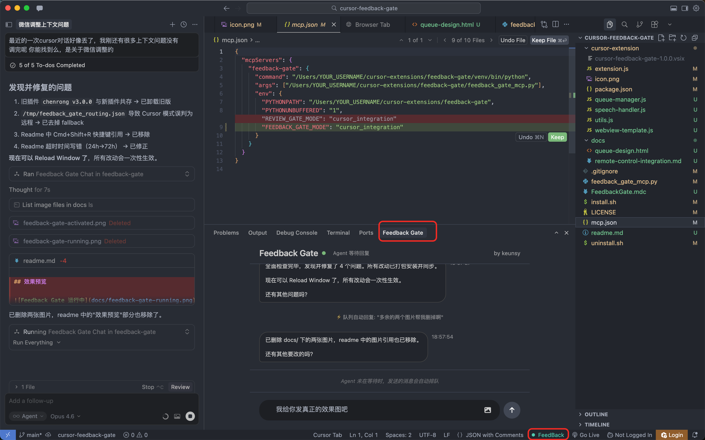

# Feedback Gate

Cursor IDE 的 Agent 反馈关卡。让 AI 在每次任务完成后等待你的确认，而不是自行结束对话。

## 它解决什么问题

Cursor Agent 处理复杂任务时，经常执行了几步就宣布完成。你不得不发起新的请求来继续，浪费宝贵的请求额度。

Feedback Gate 在 Agent 完成工作后弹出一个输入窗口，你可以在同一次请求内持续追加指令，直到真正满意为止。

## 效果预览



## 工作原理

```
你发出任务 → Agent 执行 → 弹窗等待反馈 → 你追加指令 → Agent 继续 → ... → 输入 Done 结束
```

技术上：Agent 通过 MCP 协议调用 `feedback_gate_chat` 工具，触发 Cursor 扩展弹出输入界面。用户的回复通过临时文件回传给 MCP 服务器，Agent 读取后继续执行。

## 功能

- **多位置显示** — 支持底部面板、侧边栏（Activity Bar）、编辑器标签页三种位置，可在设置中切换默认位置
- **底部面板交互** — 不占编辑器空间，Agent 触发时自动弹出
- **消息队列** — Agent 忙时发送的消息自动排队，不会丢失，支持排序、编辑、删除，出队时完整显示在对话中
- **智能心跳** — 自动发送心跳消息防止 MCP 调用超时，措辞随机变化避免 Agent 放弃等待
- **一键开关** — 状态栏绿色 `● FeedBack` 按钮，禁用后 Agent 自动放行
- **多窗口隔离** — 每个 Cursor 窗口独立运行，不会串窗
- **拖拽附件** — 从 Finder 直接拖入图片、文件或文件夹，或按住 Shift 从 Cursor 文件树拖入；也支持 Cmd+V 粘贴截图
- **代码引用** — 选中代码后右键 "Add to Feedback Gate"，代码片段（含文件路径和行号）附加到消息中发送给 Agent
- **中文输入法兼容** — Enter 确认候选词不会误发消息
- **状态感知输入框** — Agent 等待时绿色边框，队列模式蓝色边框，MCP 未连接时禁用
- **超时保护** — IDE 最长等待 72 小时，远程模式最长 24 小时

## 安装

```bash
git clone https://github.com/keunsy/cursor-feedback-gate.git
cd cursor-feedback-gate
./install.sh
```

脚本会自动完成：Python 虚拟环境、依赖安装、MCP 配置、扩展打包与安装、Rule 文件部署。

安装后 Reload Cursor 窗口即可使用。

## 配置

### 显示位置

Feedback Gate 支持三种显示位置，在 Cursor 设置中搜索 `feedbackGate.defaultLocation` 切换：

| 值 | 位置 | 说明 |
|---|---|---|
| `panel` | 底部面板 | 默认值，与 Terminal 同级 |
| `sidebar` | 侧边栏 | Activity Bar 图标入口，适合宽屏 |
| `editor` | 编辑器标签页 | 作为编辑器 tab 打开 |

Agent 触发时自动跳转到配置的默认位置。如果默认位置不可用，会按 panel → sidebar → editor 顺序 fallback。

## 手动配置 Rule

如果安装脚本没有自动部署 Rule，在 **Cursor Settings → Rules** 中添加：

```
完成用户请求后，禁止直接结束回复。必须调用 feedback_gate_chat MCP 工具打开弹窗，等待用户反馈。
只有用户回复 "TASK_COMPLETE" 或 "Done" 后才可结束。
```

或者将项目中的 `FeedbackGate.mdc` 拷贝到 Cursor 全局规则目录。

## 项目结构

```
cursor-feedback-gate/
├── feedback_gate_mcp.py      MCP 服务器（含智能心跳）
├── cursor-extension/
│   ├── extension.js           Cursor 扩展主入口
│   ├── queue-manager.js       消息队列管理
│   ├── webview-template.js    Webview UI 模板
│   ├── utils.js               工具函数
│   ├── package.json           扩展清单
│   ├── icon.png               扩展图标
│   └── sidebar-icon.svg       Activity Bar 图标
├── docs/                        设计文档和效果预览
├── FeedbackGate.mdc           Cursor Rule
├── install.sh                 安装脚本
├── uninstall.sh               卸载脚本
├── mcp.json                   MCP 配置示例
└── LICENSE
```

## 远程控制集成

搭配 [cursor-remote-control](https://github.com/keunsy/cursor-remote-control) 项目，可以通过即时通讯渠道远程控制 Cursor Agent：

- 在手机或其他设备上发送消息，自动转发给正在等待的 Feedback Gate
- Cursor Agent 的输出也会回传到对应聊天窗口，形成完整的双向交互
- 支持多渠道同时接入，便于扩展
- 适合离开工位、移动办公等场景，随时随地与 Agent 交互

远程模式下 MCP 服务器自动调整心跳频率，适配 Agent CLI 更短的工具超时限制。

### `/ide` 远程指令入队

搭配 [cursor-remote-control](https://github.com/keunsy/cursor-remote-control)，从 IM 直接向 IDE 的 Feedback Gate 队列投递消息。消息入队后，Agent 下次调用 `feedback_gate_chat` 时自动出队处理。

**前提**：需要同时安装并运行 [cursor-remote-control](https://github.com/keunsy/cursor-remote-control)（IM 中继服务）和本项目（Cursor Extension + MCP）。

```
/ide                          查看活跃实例列表
/ide 帮我检查代码               投递到唯一实例（多实例时广播）
/ide #1 顺便看下性能            按序号指定窗口
/ide #12345 跑一下测试          按 PID 指定窗口
/ide on                       开启转发模式（所有消息自动投递 IDE）
/ide off                      关闭转发模式
```

特性：
- **PID 路由** — 每个 Cursor 窗口独立队列文件，指定投递不串窗
- **转发模式** — `/ide on` 开启后所有非命令消息自动投递，手机操作更便捷
- **会话注册** — Agent 首次调用后自动注册项目名和 PID，空闲 2 小时自动注销
- **安全投递** — 检测 Extension 进程是否存活，无活跃实例时拒绝写入
- **过期保护** — Extension 重启后自动丢弃重启前的积压消息
- **双向反馈** — Agent 处理完远程消息后，结果自动回传到发起者的 IM 会话（仅回复一条）

## 卸载

```bash
./uninstall.sh
```

## 故障排查

```bash
# MCP 服务器日志
tail -f /tmp/feedback_gate.log

# 检查 MCP 配置
cat ~/.cursor/mcp.json

# 检查扩展状态
# 查看底部状态栏 FeedBack 指示灯
```

## License

MIT

---

*by keunsy*
