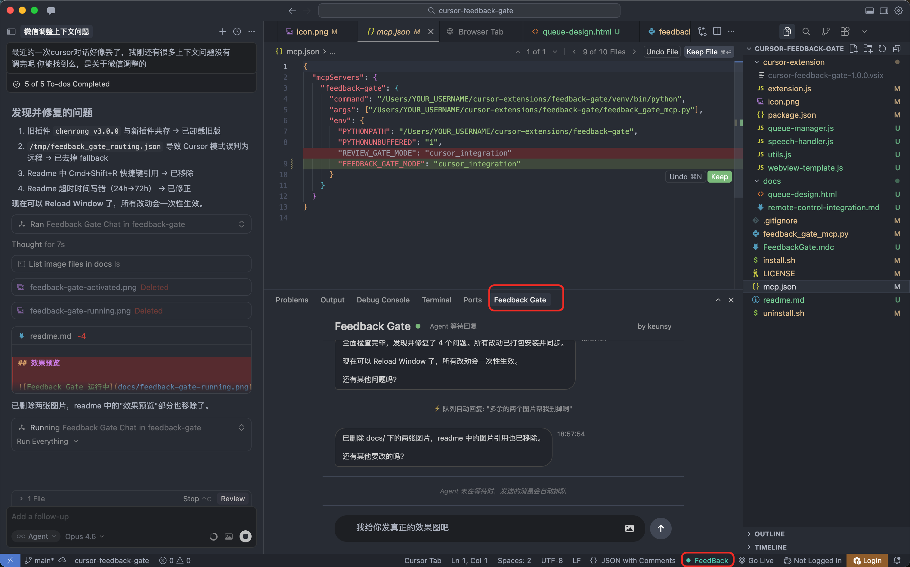

English | [中文](README.zh-CN.md)

# Feedback Gate

A feedback checkpoint for Cursor IDE Agents. Makes AI wait for your confirmation after each task instead of ending the conversation on its own.

## The Problem It Solves

Cursor Agent often declares a complex task "done" after just a few steps. You have to start a new request to continue, wasting precious request quota.

Feedback Gate pops up an input window after the Agent finishes, letting you keep giving instructions within the same request until you're truly satisfied.

## Preview



## How It Works

```
You send a task → Agent executes → Popup waits for feedback → You add instructions → Agent continues → ... → Type Done to finish
```

Technically: The Agent calls the `feedback_gate_chat` tool via MCP protocol, triggering the Cursor extension to show an input UI. User replies are passed back to the MCP server through temp files, and the Agent reads them to continue.

## ⚠️ Known Limitations (Multi-Window / Multi-Tab)

The current version supports **multi-tab concurrent conversations** and **multi-window session isolation**, but due to Cursor's MCP architecture limitations (single process sharing, multi-window routing, etc.), instability may occur in these scenarios:

**Multiple Windows (3+):**
- With too many windows, Cursor may rebuild the Feedback Gate UI, causing brief unavailability in some windows (8-second auto-retry mechanism added)
- Some windows' Feedback Gate UI may be reclaimed by Cursor while the background process is still running, causing delayed session lease release (auto-detection and release mechanism added)
- In extreme cases (5+ active windows), trigger routing may experience brief delays

**Multiple Tabs:**
- When multiple Agent conversations wait for Feedback Gate simultaneously, message routing relies on session_id matching — usually accurate
- In rare cases, messages sent during tab switching may be routed to the wrong conversation (draft stash protection in place)
- MCP protocol itself doesn't support concurrent sessions; in extreme cases, messages from multiple conversations may interleave

**Recommendation**: 1-2 Cursor windows work best. If using multiple windows, keep no more than 3 active simultaneously.

## Features

- **Multi-Tab Conversations** — Multiple concurrent Agent conversations in one window, each with its own tab
- **Multiple Display Locations** — Bottom panel, sidebar (Activity Bar), or editor tab; configurable in settings
- **Bottom Panel Interaction** — Doesn't take up editor space; auto-shows when Agent triggers
- **Message Queue** — Messages sent while Agent is busy are automatically queued; supports sorting, editing, and deletion
- **Smart Heartbeat** — Auto-sends heartbeat messages to prevent MCP call timeouts; wording varies randomly to keep Agent engaged
- **One-Click Toggle** — Green `● FeedBack` button in status bar; disable when not needed, Agent calls pass through without popup
- **Multi-Window Isolation** — Each Cursor window runs independently
- **Drag & Drop Attachments** — Drag images/files/folders from Finder, or hold Shift to drag from Cursor file tree; also supports Cmd+V paste
- **Code References** — Right-click selected code → "Add to Feedback Gate"; code snippet (with file path and line numbers) is attached to the message
- **CJK Input Compatibility** — Enter to confirm IME candidates won't accidentally send the message
- **State-Aware Input** — Green border when Agent is waiting, blue border in queue mode, disabled when MCP is not connected
- **Timeout Protection** — Max wait limit prevents Agent from hanging indefinitely due to network issues

## Installation

```bash
git clone https://github.com/keunsy/cursor-feedback-gate.git
cd cursor-feedback-gate
./install.sh
```

The script auto-completes: Python venv setup, dependency installation, MCP configuration, extension packaging & installation, and Rule file deployment.

Reload Cursor window after installation to start using.

## Configuration

### Display Location

Feedback Gate supports three display locations. Search `feedbackGate.defaultLocation` in Cursor settings to switch:

| Value | Location | Description |
|---|---|---|
| `panel` | Bottom panel | Default; same level as Terminal |
| `sidebar` | Sidebar | Activity Bar icon entry; good for wide screens |
| `editor` | Editor tab | Opens as an editor tab |

Auto-jumps to configured default location when triggered. Falls back in order: panel → sidebar → editor.

## Rule Configuration

The install script auto-deploys `FeedbackGate.mdc` to `~/.cursor/rules/`, which usually takes effect globally.

**If the Agent doesn't call Feedback Gate**, manually copy the rule to Cursor User Rules:

**Cursor Settings → Rules → User Rules** → Paste the full contents of `FeedbackGate.mdc`

## Advanced Configuration

Create `~/.cursor/feedback-gate-config.json` to customize heartbeat behavior (takes effect immediately, no restart needed):

```json
{
  "heartbeat_mode": "user_response",
  "heartbeat_reply": "current time",
  "wait_seconds": 900
}
```

| Parameter | Default | Description |
|-----------|---------|-------------|
| `heartbeat_mode` | `"waiting"` | `waiting`: returns `[WAITING]` on timeout, Agent re-calls to continue waiting; `user_response`: fakes a user reply on timeout |
| `heartbeat_reply` | `"当前时间"` | Auto-reply content in `user_response` mode (`"当前时间"` is replaced with actual timestamp) |
| `wait_seconds` | `300` | Timeout in seconds per MCP call |
| `max_total_seconds` | `3600` | Max total wait in seconds (cumulative across heartbeats); returns TIMEOUT and cleans up when exceeded |

**Why these defaults:**

- **`wait_seconds: 300`** (5 min): Cursor IDE has a timeout limit on MCP tool calls — waiting too long may cause Cursor to auto-terminate the call. 300 seconds means a heartbeat every 5 minutes to prevent timeout. Originally 600s, tuned down to 300s based on real usage. **Don't set too short** (< 60s may be flagged as abnormal); **don't set too long** (> 3300s risks hitting Cursor's hard timeout). Recommended range: **120-600 seconds**.
- **`max_total_seconds: 3600`** (1 hour): Aligned with Cursor's MCP hard timeout. After 1 hour with no user response, the user has likely left — returns TIMEOUT and releases resources. Originally 86400s (24h), reduced after finding that excessively long waits left Agents hanging. **Note: Heartbeat mechanism may cause extra request consumption.** Each time the Agent re-calls `feedback_gate_chat` after a heartbeat timeout, it may count as a request in some cases (exact behavior varies by Cursor version). If you notice abnormal quota usage, consider increasing `wait_seconds` (e.g. 600s) at the cost of slower response to user input.
- **`heartbeat_mode: "waiting"`**: Recommended. Agent knows the user hasn't replied yet and immediately re-calls to continue waiting. In `user_response` mode, the Agent treats the heartbeat as actual user input, which may trigger unnecessary actions.

Also supports environment variables: `FEEDBACK_GATE_IDE_WAIT_SECONDS`, `FEEDBACK_GATE_HEARTBEAT_MODE`, `FEEDBACK_GATE_HEARTBEAT_REPLY`. Config file takes precedence over environment variables.

## Project Structure

```
cursor-feedback-gate/
├── feedback_gate_mcp.py      MCP server (with smart heartbeat)
├── cursor-extension/
│   ├── extension.js           Cursor extension entry point
│   ├── queue-manager.js       Message queue management
│   ├── session-lease.js       Multi-window session lease management
│   ├── webview-template.js    Webview UI template
│   ├── utils.js               Utilities
│   ├── package.json           Extension manifest
│   ├── icon.png               Extension icon
│   └── sidebar-icon.svg       Activity Bar icon
├── docs/                        Design docs and preview images
├── FeedbackGate.mdc           Cursor Rule
├── install.sh                 Install script
├── uninstall.sh               Uninstall script
├── mcp.json                   MCP config example
└── LICENSE
```

## Remote Control Integration

Paired with [cursor-remote-control](https://github.com/keunsy/cursor-remote-control), you can remotely control Cursor Agent through messaging channels:

- Send messages from your phone or other devices, auto-forwarded to the waiting Feedback Gate
- Cursor Agent output is relayed back to the corresponding chat window for full bidirectional interaction
- Supports multiple channels simultaneously
- Perfect for away-from-desk or mobile scenarios

In remote mode, the MCP server auto-adjusts heartbeat frequency for the shorter CLI tool timeout.

### `/ide` Remote Command Enqueue

> ⚠️ **Experimental**: Remote command enqueue may have unstable routing in multi-window scenarios. Messages may be delivered to unintended windows or lost during window switching/restart. Recommended for single-window use only; use `#number` or `#PID` to specify target window in multi-window setups.

Paired with [cursor-remote-control](https://github.com/keunsy/cursor-remote-control), send messages directly from IM to the IDE's Feedback Gate queue. Queued messages are auto-dequeued when the Agent next calls `feedback_gate_chat`.

**Prerequisite**: Both [cursor-remote-control](https://github.com/keunsy/cursor-remote-control) (IM relay service) and this project (Cursor Extension + MCP) must be installed and running.

```
/ide                          List active instances
/ide check the code            Deliver to the only instance (broadcasts if multiple)
/ide #1 also check perf        Specify window by index
/ide #12345 run tests          Specify window by PID
/ide on                       Enable forwarding mode (all messages auto-delivered to IDE)
/ide off                      Disable forwarding mode
```

Features:
- **PID Routing** — Each Cursor window has its own queue file; targeted delivery without cross-window issues
- **Forwarding Mode** — `/ide on` auto-delivers all non-command messages; convenient for mobile
- **Session Registration** — Auto-registers project name and PID on first Agent call; auto-deregisters after 2 hours idle
- **Safe Delivery** — Checks if Extension process is alive; rejects writes when no active instance
- **Expiry Protection** — Auto-discards messages queued before Extension restart
- **Bidirectional Feedback** — After Agent processes a remote message, the result is relayed back to the sender's IM chat (one reply)

## Uninstall

```bash
./uninstall.sh
```

## Troubleshooting

```bash
# MCP server logs
tail -f /tmp/feedback_gate.log

# Check MCP config
cat ~/.cursor/mcp.json

# Check extension status
# Look at the FeedBack indicator in the bottom status bar
```

## License

MIT

---

*by keunsy*
