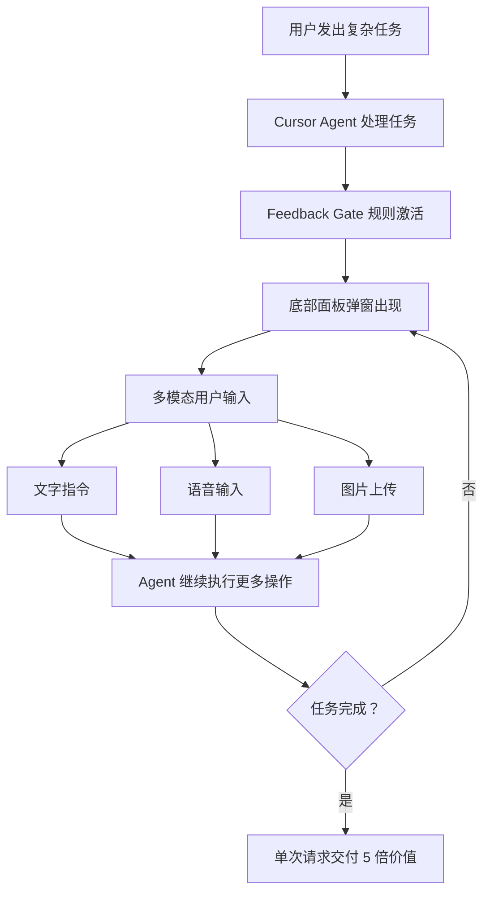

# Feedback Gate — Cursor IDE 反馈关卡

[]()
[](LICENSE)
[]()
[](https://modelcontextprotocol.io/)

## 痛点

**Cursor** 经常"过早收工"——你给它一个复杂任务，它可能只用了 ~25 次可用工具调用中的 5 次就宣布完成。后续的小改动只能发起**新请求**，频繁这样操作，宝贵的 **~500 次月度请求** 很快就会见底。

## 解决方案

**Feedback Gate** 让 AI 在完成主要工作后**不会自动结束对话**，而是弹出一个交互窗口等待你的反馈。你可以在**同一个请求的生命周期内**持续提出子指令，直到你满意为止——相当于把 1 次请求发挥出 5 次甚至更多的效果。

## 架构



## 核心特性

* **底部面板界面：** Feedback Gate 固定在底部面板区域（与终端/输出/问题并列），不占编辑器空间。Agent 触发时自动展开并聚焦。
* **一键开关：** 状态栏右侧的 `✓ FG` 按钮，点击即可切换启用/禁用。禁用后 Agent 的调用自动放行，不弹窗不等待。中途关闭开关时，当前等待的弹窗会自动回复 TASK_COMPLETE。
* **多窗口隔离：** 基于 PPID 精确匹配，每个 Cursor 窗口的 Feedback Gate 只响应自己的 MCP 实例，不会串窗。
* **中文输入法兼容：** 正确处理输入法候选词确认，Enter 不会误触发消息发送。
* **语音控制：** 点击麦克风，自然说话，本地 Faster-Whisper 自动转写为文字。
* **视觉上下文：** 直接在弹窗中上传截图、示意图、设计稿，AI 能看到并理解。
* **MCP 无缝集成：** 基于 Model Context Protocol，弹窗在需要时自动出现。
* **30 分钟超时等待：** 给你充足的思考时间。

## 工作流程

1. **你：** 给 Cursor 一个任务（消耗 1 次主请求）。
2. **Cursor AI：** 执行主要工作（编码、分析，消耗部分工具调用次数）。
3. **Feedback Gate 介入：**
   * AI 自动调用 `feedback_gate_chat` MCP 工具
   * 底部面板自动展开，弹出输入界面
   * AI 宣布等待你的输入
4. **你（在弹窗中）：**
   * **文字** 输入后续指令
   * **语音** 说出你的指令（自动转写）
   * **图片** 上传截图、设计稿等
   * 满意后输入 `TASK_COMPLETE` 结束
5. **Cursor AI：** 读取你的输入，执行操作，然后再次弹窗等待。
6. **循环！** 持续迭代，直到你输入 `TASK_COMPLETE`。

## 项目结构

```
cursor-feedback-gate/
├── cursor-extension/
│   ├── extension.js      ← Cursor 扩展（UI、弹窗、输入处理）
│   ├── package.json      ← 扩展配置
│   └── icon.png          ← 扩展图标
├── feedback_gate_mcp.py  ← MCP 服务器（Agent 工具、通信）
├── install.sh            ← 安装脚本
├── uninstall.sh          ← 卸载脚本
├── mcp.json              ← MCP 配置示例
├── requirements_simple.txt ← Python 依赖
├── LICENSE
└── readme_zh.md          ← 本文档
```

## 安装

### 第一步：安装扩展和 MCP 服务器

```bash
git clone <repo-url>
cd cursor-feedback-gate
./install.sh
```

安装脚本自动处理：
- Python 依赖安装
- MCP 服务器配置
- Cursor 扩展安装

### 第二步：配置 Cursor Rule

在 **Cursor 设置 → Rules（User 标签）** 中添加以下规则：

```
# Feedback Gate 协议

## 核心规则
完成用户请求后，**禁止直接结束回复**。必须调用 `feedback_gate_chat` MCP 工具打开弹窗，等待用户反馈。只有用户在弹窗中回复 "TASK_COMPLETE"、"Done" 等完成信号后才可结束。

## 工作流程
1. 执行任务：正常完成用户请求。
2. 打开 Feedback Gate：任务完成后立即调用 `feedback_gate_chat`，传入工作摘要。
3. 处理反馈：收到用户弹窗回复后继续执行，然后再次调用 `feedback_gate_chat`。
4. 循环直到完成：重复步骤 2-3，直到用户发送完成信号。

## 约束
- 每次回复结束前必须调用此工具，无例外。
- 超时 30 分钟无响应，正常结束并注明超时。
```

### 第三步：验证

1. Reload Window
2. 检查底部面板是否有 Feedback Gate tab（显示"等待 Agent 调用"）
3. 检查状态栏是否有 `✓ FG` 按钮
4. 向 Agent 提问，观察底部面板是否自动弹出反馈界面

## 使用技巧

* **开关控制：** 不需要反馈关卡时，点击状态栏按钮禁用，Agent 会自动放行继续执行。
* **中文输入：** 使用中文输入法时，按 Enter 确认候选词不会误发消息，Shift+Enter 换行。
* **`TASK_COMPLETE` 是退出信号：** 输入此命令让 AI 完成任务。

## 故障排查

```bash
# 检查 MCP 服务器日志
tail -f /tmp/feedback_gate.log

# 验证 MCP 配置
cat ~/.cursor/mcp.json

# 手动测试扩展
# 在 Cursor 中按 Cmd+Shift+R
```

## 许可证

MIT License

---

*by chenrong*
